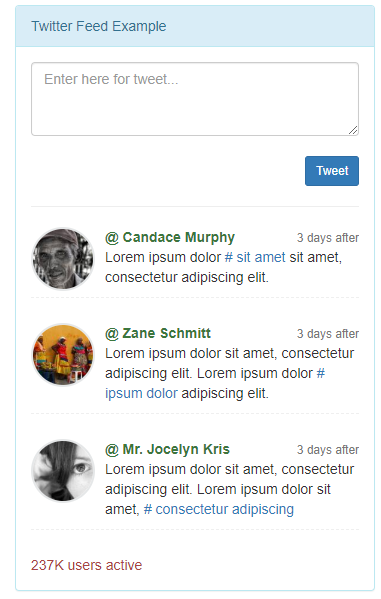
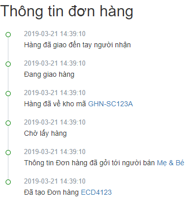

# Activity

 [](https://travis-ci.com/toancong/activity)

a laravel package follow [activity stream spec](https://www.w3.org/TR/activitystreams-core/) and [jsonapi](https://jsonapi.org/)





## Examples

https://github.com/toancong/activity-demo

## Install

```
composer require beanbean/activity
```

## Usage

### Integrate with your code

1. Add trait Activitiable in your models

```
// class User, class Product
use \Bean\Activity\Traits\Activitiable;
```

2. Add an activity when something happen

```
// when user favorite a product
app('activity')->create([
    // 'favorite'
    'type'    => ActivityConst::FAVORITE_PRODUCT,

    // selected fields to save
    'actor'   => $user->toObject('id', 'fullname', 'avatar_url'),

    // selected fields to save
    'object'  => $product->toObject('id', 'title', 'image_url'),

    // a placeholder template to use later
    'summary' => '{{actor}} {{type}} {{object}}',
]);

// when user unfavorite a product
app('activity')->delete($user, 'favorite', $product);

//browse to display
$activities = app('activity')->browse([
    'target_id' => (string)$user->id,
    'type'      => 'favorite',
], [
    'page' => [
        'size' => 50,
    ]
]);
```

### Integrate with API

Comming soon

## Todo

- [x] Activity service
- [ ] BREAD api
- [x] UI in-app notification, activity
- [ ] UI theme support
- [ ] Real-time activity
- [ ] Horizontal Partitioning

## Contribute

PR are welcome. Please open an issue first and submit PR with a good commit message. Thanks

### Dev

```
docker-compose run --rm --entrypoint=composer test install
```

### Test

```
docker-compose run --rm test
```

## License

MIT
